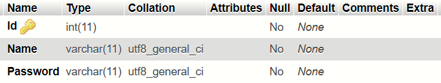

[comment]: # "This is the standard layout for the project, but you can clean this and use your own template"

# Intelligent Road Traffic Control System

---

## Team
-  E/15/280, PREMATHILAKA M.P.U., [pubuduudara7@gmail.com](mailto:pubuduudara7@gmail.com)
-  E/15/316, Samarasinghe U.G.S.B., [e15316@eng.pdn.ac.lk](mailto:e15316@eng.pdn.ac.lk)
-  E/15/123, HERATH H.M.M.E.W.L., [wisheslakshan@gmail.com](mailto:wisheslakshan@gmail.com)

## Table of Contents
1. [Introduction](#introduction)
2. [Solution Architecture](#solution-architecture )
3. [Hardware & Software Designs](#hardware-and-software-designs)
4. [Links](#links)

---

## Introduction

Vehicle travel across the world is increasing, especially in larger urban areas. It is a serious problem in traffic congestions in many major cities around the world and in these cities, it has become a nightmare for travelers. Since Traditional systems have implemented to follow a preset time schedule, they do not control variable flows coming near junctions.
There is a goal of customizing traffic flow vehicles in a junction. As the number of roads increases steadily, and the resources provided by the current infrastructure are limited, intelligent control of traffic in the future will become a very important issue. Therefore, to better accommodation of this increasing demand, traffic control algorithms need to be simulated and optimized.  
#### “One study done in Boston has proved the timings of 60 intersections in one district of the city could save $1.2 million per year”  
  

[Intro Video](https://youtu.be/y0rYvnbv9V0)

## Solution Architecture

#### Our Approach:  
  

## Hardware and Software Designs

### Communication Protocol  
#### Components  
- ESP32
- Arduino Nano
- nrf24l01 Modules  

In our system, the relay node is the ESP32 board. Arduino Uno board works as the microcontroller for the sensor node. We needed to build up a communication system between the sensor node and relay nodes in order to send real-time vehicle count taken by sensor nodes. There are 4 sensor nodes per junction in the prototype.  
#### Overview  

 

In order to establish the communication, we used nrf24l01 radio modules both in the sensor node and relay nodes. We tried to implement a protocol for our system using RF as the media and it is succeded. In this protocol relay node uses different pipes to communicate with each of the sensor nodes. Through this implementation, we could overcome the broadcasting issue and we could establish one to one communication.  

[References](https://github.com/nRF24/RF24)  

### Vehicle Simulator  
As the demonstration has planned to do with a prototype of a junction which intersects two roads, other junctions will be demonstrated using the simulator software. Using a camera fixed from the top of the prototype, the video stream is taken to the simulator for the convenience of observing the behavior of the algorithm.  
[Simulator](data/videos/Vehicle_Simulator_So_Far.mp4)  
We started developing this software from scratch and we were able to implement the following feature in it.  
- Add vehicle defining a custom path using GUI
- Stepwise simulation
- Continuous simulation
- Add vehicles while the simulation is running
- Simulating multiple vehicles at the same time
- Pause and continue the simulation
- Camera View added and it can work while the simulation is running (Not showing in this video)  

### Communication Between Sensor nodes and the Relay node  
#### Problem :  
The sensor node should keep listening to the magnetic reed sensors all the time, while it should be listening for the requests from the Relay node at the same time. Since we have an Arduino Nano microcontroller as the driver of sensor nodes, they can not handle two tasks at the same time.  
#### Solution:  
So, we came up with a solution for the above matter. We found that the availability of an interrupt pin on the NRF24l01 modules which we use for the radio communication. The interrupt pin on the module is called “IRQ” (Interrupt ReQuest) pin.

The IRQ pin is normally HIGH and by default, it will send out a low pulse at three different events when  
- It received data

- It transmitted data

- Transmission failed or no ack received

The maskIRQ (tx_ok, tx_fail, tx_ready) function from the TRMh20 RF24 library can be used to enable the above three functionalities.

We used this signal to trigger an external interrupt (we used digital pin 3) on the Arduino Nano module. Then, when the Relay Node makes a request to the Sensor node asking for the required information, the sensor node can sense the incoming request and it will only reply on that point of the time and it goes back to keep listening to the magnetic reed sensors.

 
#### Results:

 

We implemented the above-mentioned functionality and tested it. We measured the response time of the Sensor node, the time it takes to receive the request from the relay node and respond to it with the vehicle count. The average time was about 24ms.

 

Also, we sent requests from the Relay node with very fewer time delays between two requests, to check whether the sensor node has time to respond to the request and go back to counting vehicles. We set the delay between requests to 10ms and verified that the sensor node can even handle requests at the amount of requesting frequency.  

### Complete Network Diagram & Protocols  
  

#### Communication between the Relay node and the Server

In the system, the database, server and the server program running on a standalone Raspberry Pi 3 devices. ESP32 board uploads real-time vehicle count in each lane of the junction to the server.  

 

To accomplish this we have used MQTT protocol since it is the most suitable protocol for real-time communication. In this network, the Raspberry pi device is functioning as the mosquito broker and esp32 working as an MQTT client. We will describe how the overall protocol works in the coming posts.

#### Web Application

 

Any host on the same network can access to the system website using the raspberry pi’s IP address. The server program, database and the front end application is running on the Raspberry Pi device. The HTTP protocol is used for this communication.  

### Prototype Developments  
#### Sensor node module  

#### Relay Node module  
This module is the one that keeps polling the Sensor node modules in a separate thread in it. It will send a request to a Sensor node. That request message will be received by the Sensor node and it produces an interrupt from the Sensor node’s NRF module using its IRQ pin. The Relay Node waits for the replay and stores the replay in it.

The other role of the Relay node is to keep communication with the Server.  

  

#### Color lights arrangement  
  

### Website of the project
 

#### Introduction
Optimizing the current traffic controlling system is a project that can be undertaken as a mandatory requirement for society as the current human lifestyle as mentioned before. Build up the website that fulfills the user needs will be a great help for the users to maintain their day to day lifestyle in the scope of traffic congestions.  

#### The front-end

Usability, or User Experience, is the art of making your website simple, user-friendly and easy to use. Understanding the customer’s online behavior gives you insight into what works and what doesn't.  

Homepage  
  
Login window  
  
On this website, the responsiveness is considered

#### Database

As of now, we have implemented a database that includes 7 tabulations. All the details are provided below.  

##### Junction1  
  
There are 3 more junctions which have the same table structure. From above table, the vehicle count at the update time can be obtained. laneId is the primary key. This table is filled by the relay node of the junction.  

##### Feedback table  
  
Above table can be used to obtain the user’s feedback and their suggestions about the service and also the websites. ID is the primary key of the table.  

##### User_Accounts  
  
Above table is reserved for the administrators. The purpose of building up this table is to reserve space for the people who update the algorithm that runs at the back-end of the project.  

#### MQTT clients and broker full system

 

MQTT is a lightweight publish/subscribe messaging protocol designed for M2M (machine to machine) telemetry in low bandwidth environments. MQTT stands for Message Queuing Telemetry Transport.

 

The first concept is the publish and subscribe system. In a publish and subscribe system, a device can publish a message on a topic, or it can be subscribed to a particular topic to receive messages  

  

##### MQTT Topic

Topics are the way you register interest for incoming messages or how you specify where you want to publish the message.

 

##### MQTT Broker

The broker is primarily responsible for receiving all messages, filtering the messages, decide who is interested in them and then publishing the message to all subscribed clients. There are several brokers we can use.

 

In the project we have used  Mosquitto broker which is installed on the raspberry pi device and it works as the server to the junction. Relay node works as the MQTT client to the Mosquitto server. Broker is programmed using python and broker program uploads data to the SQL database which is located on the raspberry pi device.  

## Links

### Documents  
- [Project Report](data/documents/ProjectMilestone2.pdf)  
- [Project Proposal](data/documents/ProjectProposalRevisionworkshop.pdf)

### Other Links

- <a href = "https://github.com/cepdnaclk/e15-3yp-Intelligent-Road-Traffic-Control-System" target = "_blank"> Project Repository </a>
- <a href = "https://cepdnaclk.github.io/e15-3yp-Intelligent-Road-Traffic-Control-System/" target = "_blank">Project Page</a>
- <a href = "http://www.ce.pdn.ac.lk/" target = "_blank">Department of Computer Engineering</a>
- <a href = "https://eng.pdn.ac.lk/" target = "_blank">University of Peradeniya</a>

[//]: # (Please refer this to learn more about Markdown syntax)
[//]: # (https://github.com/adam-p/markdown-here/wiki/Markdown-Cheatsheet)
